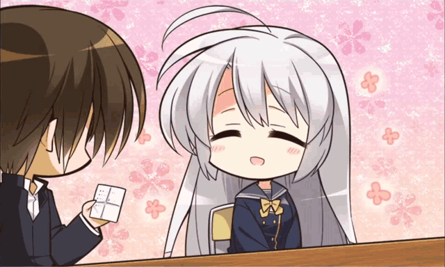

<div align="center">


# NeneBot: A RAG-Powered Ayachi Nene AI Companion

 <div>&nbsp;</div>



 <div>&nbsp;</div>

<p align="center">
  <b>A RAG-Powered Conversational AI for Ayachi Nene — runs locally or on any cloud LLM</b><br>
  <i>"メンカタカラメヤサイダブルニンニクアブラマシマシ！"</i>
</p>

 <div>&nbsp;</div>

<p align="center">
  
  
  
  
  
  
</p>

<p align="center">
  
  
  
  
</p>

<p align="center">
  <a href="LICENSE"></a>
</p>

<div>&nbsp;</div>

> A RAG conversational AI combining FAISS semantic retrieval with pluggable LLM backends (Claude, DeepSeek, or local Ollama). Features multi-turn session memory, SSE token streaming, a modern Vue 3 immersive Galgame UI, and similarity-threshold filtering for hallucination-free character reproduction.

<div>&nbsp;</div>

[**中文文档 (Chinese Version)**](README_ch.md) | [**Vision**](#vision) | [**Features**](#features) | [**Quick Start**](#quick-start) | [**Architecture**](#architecture) | [**FAQ**](#faq)

</div>


---

## Vision

Traditional AI role-playing bots often suffer from two fatal flaws: **"Hallucinations"** (making up fake lore) and **"OOC"** (Out of Character responses). While conventional Fine-tuning can help, it is hardware-intensive and rarely eradicates these issues completely.

**NeneBot** is an attempt to bring **RAG (Retrieval-Augmented Generation)** architecture to *Galgame* character simulation:
* **External Memory Engine**: By slicing and vectorizing the original script of *Sanoba Witch*, we give the AI "true" memories.
* **Authentic Reproduction**: The LLM is forced to reference retrieved original dialogue, perfectly capturing Nene's gentle and shy personality.
* **Pluggable LLM Backend**: Swap between local Ollama and cloud APIs (Claude, DeepSeek) with a single environment variable — no code changes required.
* **Ultimate Front-end Aesthetics**: Ditching clunky terminal interfaces for an immersive, modern visual novel (Galgame) UI.

---

## Features

* **Flexible LLM Backend**: Use local Ollama (Qwen 2.5, Llama, etc.) for full privacy, or plug in a cloud API (Claude, DeepSeek) via a single `LLM_PROVIDER` env var for higher quality.
* **Multi-Turn Memory**: Per-session conversation history (sliding window) keeps Nene contextually aware across turns.
* **Real-Time Token Streaming**: SSE-based streaming delivers a native typewriter effect — responses appear word by word.
* **Millisecond Semantic Retrieval**: Utilizes Meta's FAISS vector database alongside the `bge-small-zh` embedding model to pinpoint relevant historical scripts.
* **Threshold Fallback Mechanism**: Features a custom `match_threshold` filter (cosine similarity, default `0.55`). If the topic is unfamiliar, Nene seamlessly transitions to zero-shot character playing rather than forcing irrelevant memories.
* **Immersive Visual Experience**: A stunning Vue 3 + Vite front-end featuring a dark glassmorphism UI, typewriter effects, and dynamic breathing layouts.
* **Out-of-the-Box Automation**: Includes 1-click installation and startup scripts for both Windows and Linux. No terminal anxiety required.

---

## Quick Start

### Option A — One-Click Cloud Deploy (no local setup)

Deploy to [Railway](https://railway.app) in under 5 minutes. Users only need a browser URL.

1. Fork this repo and connect it to Railway.
2. In Railway's **Variables** panel, set:
   ```
   LLM_PROVIDER=deepseek
   OPENAI_COMPAT_API_KEY=sk-...
   ```
3. Railway builds the frontend, installs deps, and starts the server automatically.
4. Share the generated `*.railway.app` URL — done.

---

### Option B — Local Setup

Before starting locally, decide **which LLM backend** you want to use:

* **Local Ollama**: zero API cost, fully local, recommended for offline/private use.
* **Cloud API (Claude / DeepSeek / OpenAI-compatible)**: better quality and easier setup on lower-end machines.

Create a local `.env` file before your first run:

```bash
cp .env.example .env
```

Then edit only the fields relevant to your provider:

```env
# Option 1: Local Ollama
LLM_PROVIDER=ollama
OLLAMA_BASE_URL=http://127.0.0.1:11434
LLM_MODEL_NAME=qwen2.5

# Option 2: DeepSeek
# LLM_PROVIDER=deepseek
# OPENAI_COMPAT_API_KEY=sk-...
# OPENAI_COMPAT_BASE_URL=https://api.deepseek.com
# OPENAI_COMPAT_MODEL=deepseek-chat

# Option 3: Claude
# LLM_PROVIDER=claude
# ANTHROPIC_API_KEY=sk-ant-...
# CLAUDE_MODEL_NAME=claude-haiku-4-5-20251001
```

> **Good to know:** This repo already includes `data/raw/train.jsonl` and a prebuilt `vector_store/` directory. On a fresh machine, `scripts/setup.sh` will also rebuild the FAISS index if needed.

### For Windows Users

**Step 1: Install Prerequisites (Skip if already installed)**
1. Download and install [Python 3.10+](https://www.python.org/downloads/). **[CRITICAL]**: Ensure you check <kbd>Add Python to PATH</kbd> at the bottom of the installer!
2. Download and install [Node.js (LTS version)](https://nodejs.org/).
3. *(Only if using local Ollama)* Download and install [Ollama for Windows](https://ollama.com/download/windows).

**Step 2: Download NeneBot**
Click the green `Code` button on this GitHub page and select `Download ZIP`. Extract it to a folder on your PC (e.g., `D:\NeneBot`).

**Step 2.5: Configure your provider**
Copy `.env.example` to `.env`, then fill in the keys only if you are using a cloud provider.

**Step 3: One-Click Ignition!**
Open the extracted folder and **double-click `start_windows.bat`**.
* Grab a coffee. The script will automatically download dependencies, wake up the AI engine, and launch your browser.
* Once the UI pops up, Nene is ready to chat!

---

### For Linux Users 

Open your terminal and execute the following elegant commands:

```bash
# 1. Clone the repository
git clone https://github.com/your-username/NeneBot.git
cd NeneBot

# 2. Create your local environment file
cp .env.example .env

# 3. Grant execution permissions to scripts
chmod +x scripts/setup.sh scripts/run.sh

# 4. Run the automated setup (Only required once)
./scripts/setup.sh

# 5. Ignite the engines!
./scripts/run.sh
```

> **Tip:** Once started, visit `http://localhost:5173` in your browser for the UI. The backend API Swagger docs are located at `http://localhost:8000/docs`.
>
> **Important:** Do **not** open `frontend/index.html` directly in the browser. The application requires a running FastAPI backend (`/v1/*`) and should be accessed through the Vite dev server (`5173`) or the compiled production build served by FastAPI.

### Option C — Single-Port Local Run (production-like)

If you want to access the full app from **one URL only** instead of running Vite separately:

```bash
# 1. Backend
python3 -m venv venv
source venv/bin/activate
pip install -r requirements.txt

# 2. Frontend build
cd frontend
npm install
npm run build
cd ..

# 3. Serve both API and frontend from FastAPI
python -m uvicorn src.main:app --host 0.0.0.0 --port 8000
```

Then open:

* `http://localhost:8000` → Full application
* `http://localhost:8000/docs` → API docs

---

## Architecture

This project strictly adheres to microservice and front/back-end decoupling standards:

```text
NeneBot/
├── 📂 data/             # Raw script corpus (for vectorization)
├── 📂 vector_store/     # FAISS persistent vector index
├── 📂 frontend/         # Vue 3 + Vite immersive UI
├── 📂 src/              # FastAPI core backend service
│   ├── api/             # Routing and Pydantic data validation
│   ├── core/            # pydantic-settings config and global exceptions
│   ├── infrastructure/  # External adapters (FAISS, Ollama, Claude, DeepSeek)
│   └── services/        # Core business logic (RAG pipeline, Embeddings, Sessions)
├── 📂 scripts/          # DevOps toolbox (Setup, Run, Linters)
├── 📄 railway.toml      # One-click Railway deployment config
├── 📄 .env.example      # Environment variable template
├── 📄 pyproject.toml    # Industrial linter configs (Ruff & Mypy)
└── 📄 requirements.txt  # Python dependency list
```

---

## Advanced Configuration

For developers who want to tweak the bot, you can easily customize Nene:

* **Switch LLM Provider**: Set `LLM_PROVIDER` in `.env` to `ollama`, `claude`, `deepseek`, or `openai`. See `.env.example` for the full list of required keys.
* **Adjust Strictness**: Modify `MATCH_THRESHOLD` (default `0.55`) in `.env` or directly in `src/services/rag_pipeline.py`. Lower values make her stick strictly to the script; higher values allow more creative freedom.
* **Change Sprites & Backgrounds**: Replace `nene_sprite.png` and `bg_room.png` in the `frontend/public/` directory. Changes apply instantly in dev thanks to Vite HMR.
* **Modify Character Persona**: Edit the `_CHARACTER_CARD` constant in `src/services/rag_pipeline.py` to add new personality traits or instructions.
* **Rebuild the Memory Index**: If you replace `data/raw/train.jsonl`, run `python scripts/init_vector_db.py` to regenerate `vector_store/`.

---

## FAQ

<details>
<summary><b>1. "Python / Node is not recognized as an internal or external command" on Windows?</b></summary>


You either haven't installed Python/Node.js, or forgot to add them to your environment variables. Reinstall them and ensure you check the "Add to PATH" option.
</details>

<details>
<summary><b>2. The chat shows a connection error or "Nene's thoughts disconnected"?</b></summary>

First verify that the backend is actually running:

* Frontend dev mode: open `http://localhost:5173`
* Backend health check: open `http://localhost:8000/health`
* API docs: open `http://localhost:8000/docs`

**If using Ollama:** The Ollama service may not be running, or your machine ran out of VRAM/RAM. Try running `ollama run qwen2.5` manually. On Linux/WSL, also ensure no system proxy is intercepting localhost traffic (`unset http_proxy`).

**If using a cloud API:** Verify that your `ANTHROPIC_API_KEY` or `OPENAI_COMPAT_API_KEY` is set correctly in `.env` and that `LLM_PROVIDER` matches.
</details>

<details>
<summary><b>3. Can I open the page directly without starting anything?</b></summary>

No. This is not a static HTML demo.

The Vue page depends on the FastAPI backend for `/v1/chat/stream`, session memory, and RAG retrieval. Use one of these two modes instead:

1. **Development mode**: `./scripts/run.sh` then open `http://localhost:5173`
2. **Single-port mode**: build `frontend/dist`, start FastAPI, then open `http://localhost:8000`
</details>

<details>
<summary><b>4. Can I swap the character to someone else (e.g., Ayase Mitsukasa)?</b></summary>


Absolutely! This is a universal architecture. Simply:

1. Replace <code>data/raw/train.jsonl</code> with Ayase's dialogue data.
2. Run <code>python scripts/init_vector_db.py</code> to rebuild the memory database.
3. Replace the sprite assets in <code>frontend/public/</code>.
4. Update the character name and persona in the system prompt.
</details>

---

## Contributing

We welcome contributions from the community! Whether it's fixing bugs, improving the CSS aesthetics, or providing better script datasets, please follow these steps:

1. `Fork` the Project.
2. Create your Feature Branch: `git checkout -b feature/AmazingFeature`
3. Commit your Changes: `git commit -m 'feat: Add some AmazingFeature'`
4. Push to the Branch: `git push origin feature/AmazingFeature`
5. Open a Pull Request.

*(Note: Before submitting PRs, please run `./scripts/run_linter.sh` to ensure your code passes our strict Ruff and Mypy checks.)*

---

## License

Distributed under the **[GNU General Public License v3.0](https://www.gnu.org/licenses/gpl-3.0)**.
This project is for technical exploration and learning purposes only. The copyright of the character sprites, background art, and game scripts belongs to the original creator (Yuzusoft). Please do not use them for commercial purposes.
